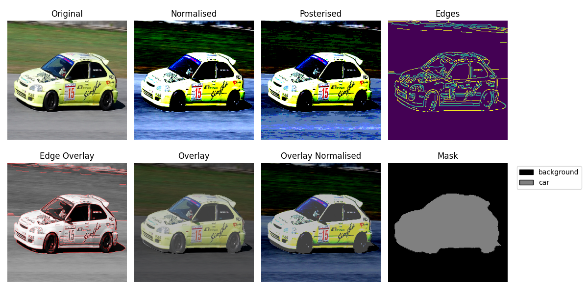
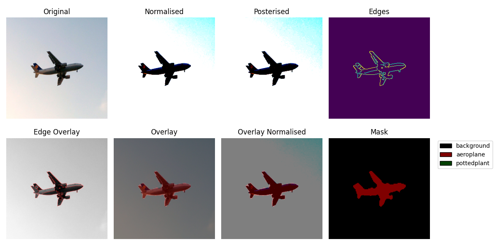
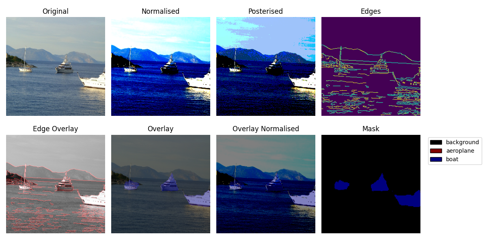
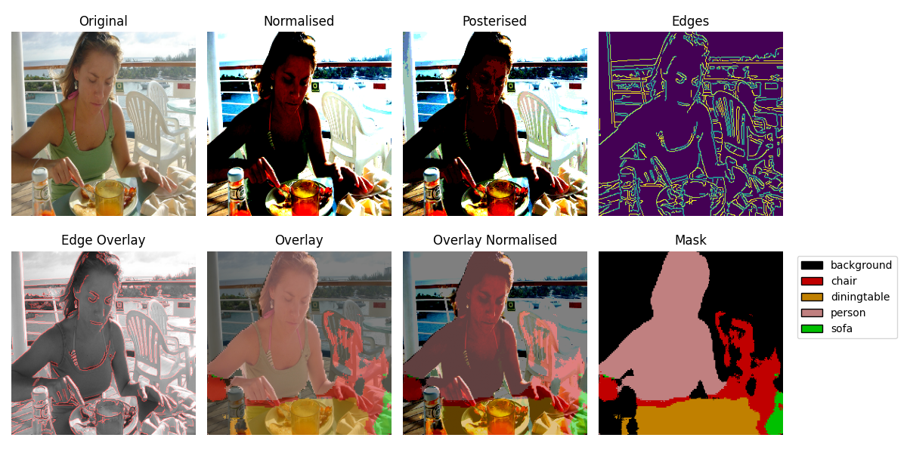

# Data Augmentation Strategies for Improving DCNN Outputs
The quality of input data plays a major role in the quality of outputs of neural networks.

> [!IMPORTANT]
> ## Pretrained Models
> Download the pretrained model weights from the Releases page:<br>
> https://github.com/haydenmillard-dev/augmentation/releases<br>
> <br>Place it in
> ```txt
> checkpoints/
> └─── model_best.pth
> ```

## Training a Neural Network
Run the following command:
```bash
python -m augmentation.training.train -a unet -b resnet -d multi -m deep-input
```
[-a] [--architecture] Selects the model architecture | Choices=[unet]<br>
[-b] [--backbone] Selects the encoder backbone | Choices=[resnet, none] | resnet is a pretrained ResNet34 model. none uses the default U-Net encoder which is not pretrained.<br>
[-d] [--data-augmentation] Selects the augmentation strategy | Choices=[aug, multi] | aug implements a basic 3 channel augmentation | multi implements 3 separate augmenations stacked upon each other and requires a mapper.<br>
[-m] [--mapper] Selects the input adapter | Choices=[none, input, multi-layer, deep-input] | deep-input is recommended as it gives the best results.

## Making a Prediction:
This requires that a model has already been trained and saved to a file named best_{data-augmenation}_{mapper}_{backbone}_{architecture}.pth in a directory named checkpoints.<br>
Run the following command:
```bash
python -m augmentation.visualisations.predict -a unet -b resnet -d multi -m deep-input
```
The above command takes the same arguments as training\train.py
You will be prompted to select an image from your local machine for the model to predict the semantic bounds.
> [!NOTE]
> There are only 20 classes in the PASCAL VOC 2012 dataset, 21 if the background class is included. Therefore, it is recommended to use images containing the below classes.


## What is data augmentation?
These are all techniques that modify input data to aid in the generalisation of a learning algorithm.
By changing the inputs, we aim to highlight generalisable features that reduce overfitting. This is particularly useful for small datasets like the VOC 2012 dataset as it can extend the effective size of the dataset.

## Example of Data Augmentations and the Prediction
The original image is not passed to the model. Instead it is processed 3 times:<br>

- First, it is normalised. This is given to the model in the first 3 input channels.
- Second, it is posterised. This is given to the model in the following 3 input channels.
- Finally, Canny edge detection is computed. This is given in the seventh and final input channel.

### Some examples follow
<p>
The top rows represent the augmentations given to the neural network.<br>
The bottom rows depict the overlaid prediction for the input image.<br>
</p>





## PASCAL VOC 2012 Classes

| | | | |
|---|---|---|---|
| Background | Aeroplane | Bicycle | Bird |
| Boat | Bottle | Bus | Car |
| Cat | Chair | Cow | Dining Table |
| Dog | Horse | Motorbike | Person |
| Potted Plant | Sheep | Sofa | Train |
| TV/Monitor |  |  |  |

## Fractures in the Model
Although the model generally produces good segmentations, it is not a guaruntee that it will always produce an acceptable mask.<br>
Below is a demonstration of a failure mode.
<br><br>


## ResNet
Academic resource: https://arxiv.org/abs/1512.03385
## U-Net
Academic resource: https://arxiv.org/abs/1505.04597
## Representation Learning Theory (RLT)
Academic resource: https://arxiv.org/abs/1206.5538

## Explored Architectures
- U-Net
- U-Net with a ResNet backbone for the encoder module
- U-Net with a ResNet backbone for the encoder module and a single layer adapter
- U-Net with a ResNet backbone for the encoder module and a multi-layer adapter
- U-Net with a ResNet backbone for the encoder module and a deep layer adapter

## Multi-input Augmentaiton & Adapters
Multi-input augmentation is an idea that stems from data augmentation:
- Data augmentation aims to modify input representations to assist neural nets to generalise to the underlying data's distribution.
- As a secondary effect, data augmenation also increases the effective size of the training data, thereby improving model accuracy.
- RLT emphasises that neural networks should learn to "disentangle the factors of variation" to converge on meaningful representations.
- Multi-input data augmentation, like standard data augmenation, hopes to promote this philosophy by providing multiple representations of the same input.

## The Heuristic
- Standard data augmentation regimes provide one variant of the input per epoch.
- Conversely, multi-input data augmenation provide multiple variants of the input per epoch.
- This means that for each epoch, there are N! more variations of the inputs provided.
